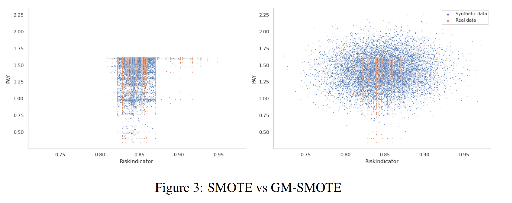
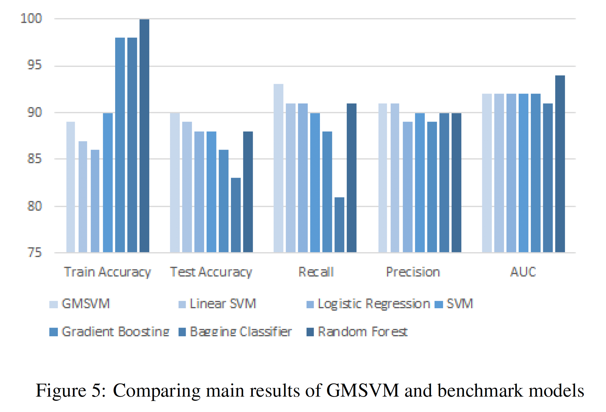

# Gaussian Mixture Support Vector Machines (GMSVM) for Credit Scoring
## Overview

This repository contains the implementation of the Gaussian Clustered Support Vector Machine (GMSVM), a novel hybrid clustering-classification approach designed for credit risk assessment. GMSVM was developed to improve the efficiency and performance of the traditional Support Vector Machine (SVM), especially when dealing with the challenges posed by **imbalanced datasets** in credit scoring.

## Methodology (GMSVM)

The GMSVM model is a combination of the Gaussian Mixture Model (GMM) and the Support Vector Machine (SVM).

### The core approach is as follows:

**1- Imbalance Treatment & Clustering:** The GMSVM leverages the Gaussian Mixture Model (GMM) for partitioning the training dataset into distinct, localized subsets. A significant benefit of this approach is that the GMM's component distributions can be used to effectively manage data imbalance by guiding the sampling and segmentation process, ensuring more balanced and efficient training for the local classifiers.

This method is an extension of the standard SMOTE approach, which we call GM-SMOTE:

**2-Classification:** A linear SVM is constructed within each resulting training subset and serves as a base classifier.

**3-Ensemble:** The final classification result is derived from the ensemble of the base SVM classifiers.

## Performance Highlights
The GMSVM approach demonstrates improved classification performance compared to the standard linear SVM method.

The model's accuracy is specifically investigated and proven effective on real-world imbalanced datasets.

GMSVM's performance is shown to be comparable or superior to four other standard credit scoring models:

If you require full access to the submitted paper, please contact me directly.
